<h1 align="center">
  <a href="https://github.com/ChangyangOpenSource/carbon-energy-management" target="_blank">omo多分校教培平台</a>
  
[](https://www.apache.org/licenses/LICENSE-2.0)


</h1>

## 目录

- [项目介绍](#项目介绍)
- [软件架构](#软件架构)
  - [功能架构](#功能架构)
- [快速入门](#快速入门)
- [功能展示](#功能展示)
- [更新日志](#更新日志)
- [许可证](#许可证)
- [联系我们](#联系我们)

## 项目介绍

开源多分校教培系统,包含在线教学、招生和管理等完整功能，让教育机构可以零门槛建立网校，成功转型在线教育。也可作为企业内训平台，帮助企业实现人才培养

## 软件架构

本系统采用前后端分离模式开发和运行。前端使用vue框架并基于 Ant Design Of Vue 组件库进行开发。后端使用 springboot + redis + mysql 微服务方式进行搭建，可单机运行也可集群运行。 

### 功能架构
 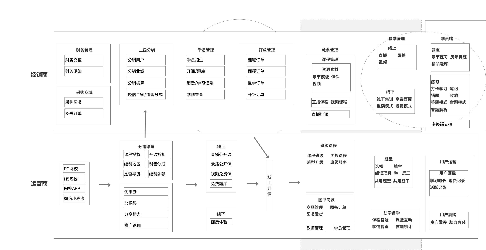

#### 环境配置要求：

- 语言：Java 8+ (小于17)

- IDE(JAVA)： IDEA (必须安装lombok插件 )

- IDE(前端)： Vscode、WebStorm、IDEA

- 依赖管理：Maven

- 缓存：Redis

- 数据库脚本：MySQL5.7+  &  Oracle 11g & Sqlserver2017（其他数据库，[需要自己转](https://my.oschina.net/jeecg/blog/4905722)）

#### 后端

- 基础框架：Spring Boot 2.6.14

- 微服务框架： Spring Cloud Alibaba 2021.0.1.0

- 持久层框架：MybatisPlus 3.5.1

- 报表工具： JimuReport 1.5.8

- 安全框架：Apache Shiro 1.10.0，Jwt 3.11.0

- 微服务技术栈：Spring Cloud Alibaba、Nacos、Gateway、Sentinel、Skywalking

- 数据库连接池：阿里巴巴Druid 1.1.22

- 日志打印：logback

- 其他：autopoi, fastjson，poi，Swagger-ui，quartz, lombok（简化代码）等。


#### 前端

- Vue2版本：`Vue2.6+@vue/cli+AntDesignVue+Viser-vue+Vuex等`
- node版本: 16.18.1

## 快速入门
以下指南将帮助你在本地机器上安装和运行该项目，进行开发和测试

### 安装步骤：
1.克隆仓库
```bash
git clone https://github.com/ChangyangOpenSource/online_merge_offline_education.git
```
2.安装依赖
```bash
npm install
```
3.运行项目

```bash
npm run dev
```
## 功能展示
### 学员端
01 ｜学生端·首页

专业选择：展示运营商web管理后台设置的专业学科列表；

活动banner：显示用户符合条件参加的专业学科活动；

直播预告：当前专业学科下待直播的课堂列表；

直播预告-详情：显示包含该直播的课程列表，购买课程可解锁直播观看；

热销课程：运营后台配置推荐的课程列表；

系列课程：展示运营后台上架标记系列标签的课程班级列表；

模块课程：显示运营端后台标记模块标签的直播课程和视频课程；

面授课程：线下进行面授的课程列表；

02 ｜学生端首页·热销课程

试听课程：后台课程管理-课程单元开通试听的视频，包含未上锁、微信解锁、分享解锁，购买解锁四种解锁观看方式；

试听直播：后台课程管理-课程单元开通试听的直播；

03 ｜学生端首页·系列课程

系列标签：运营端后台配置专业学科下的系列课程标签；

班级课程：显示班级列表，包含各班级的标题、内容类型、章节数、适用年份、价格、划线价格；

班级课程-班级详情：包含班级的介绍，课程，资料，服务

班级详情-查看协议：展示课程相关规定协议；

班级详情-课程：上半部分试听体验为后台视频课程关联配置的视频素材，下半部分课程目录为后台课程班级配置的视频课程列表，视频课程可以包含多个课程单元，未订购课程显示试听或未订购，已订购的可选择播放；

班级详情-资料：后台课程班级上配置的配套图书；

班级详情-服务：后台课程班级上配置的班级服务；

04 ｜学生端首页·模块课程

模块标签：数字字典配置学习阶段，课程类型，专业学科下的模块课程标签；

课程列表：显示后台标记为模块的直播课程和视频课程，包含学习阶段、章节数、课程销售信息；

课程详情：该课程下所有的课程单元信息，未订购课程显示试听或未订购，已订购课程可选择播放

05 ｜学生端首页·面授课程

班级课程：显示后台添加的面授班级列表，包含班级标题、面授天数、章节数、适用年份、价格、面授地点；

面授详情：上半部分为班级详情，中间为课程讲师，底部为班级上配置的配套课程；

06 ｜学生端·题库

每日一练：可进行打卡学习，显示参与人数、正确率、超越人数；

错题：显示学生答错的列表，包含答错次数，时间，可以通过消灭错题功能对历史错题进行专题练习；

收藏：显示收藏的题目列表，对收藏题目进行答题；

收藏-智能组题：学生可以自定义题型、题源、模式组成一套试卷，然后进入答题模式，包含答题卡、笔记、背题模式、收藏题目、设置字号显示大小等功能；

笔记：学生答题过程中记录的笔记列表，可以溯源到单个笔记对应的原题；

模拟机考：详见机考小程序；

模拟自测；上边经典试卷为运营后台试卷管理组合的题目，中间智能考试会根据设置的考试科目从题库中随机抽取各个题型进行答题，底部为用户的考试记录；

章节练习：展示运营商web管理后台设置的题库列表，学生选择题库进入答题，包含未解锁、开始做题、继续做题三种状态；

历年真题：展示过去年份的考试试题，选择试卷进入答题模式；

精品题库：运营后台设置的精品题库列表；

07 ｜学生端·学习

我的课程：显示用户领取或购买的课程列表；

直播计划：展示当前日期内的直播课程安排，包含直播中、我有课、有直播三种状态；

08 ｜学生端·我的

课程订单：显示学生的待支付、已完成、待发货、待收货等全部订单信息；

收货地址：学生设置的收货地址；

关于我们：管理机构运营商的介绍信息；

意见反馈：学生提交使用过程中的投诉建议；
### 运营商端
- 资源管理-经销渠道
    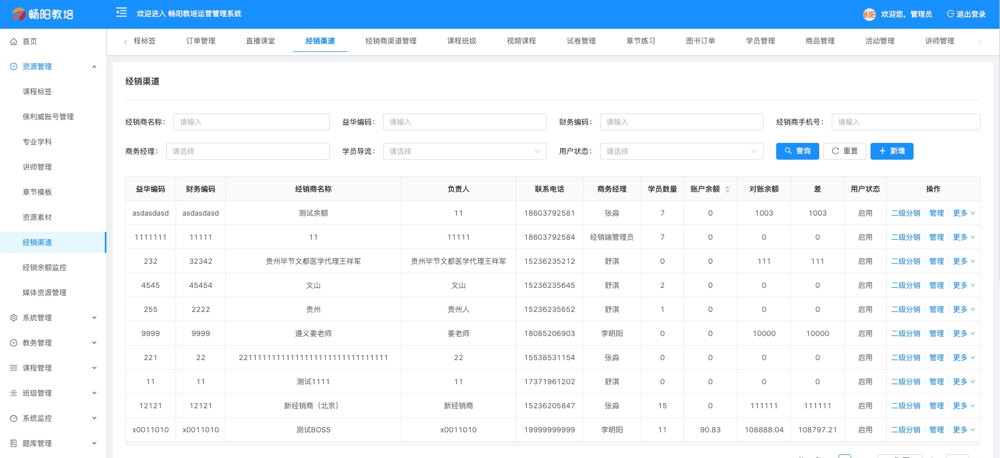
- 资源管理-讲师管理
   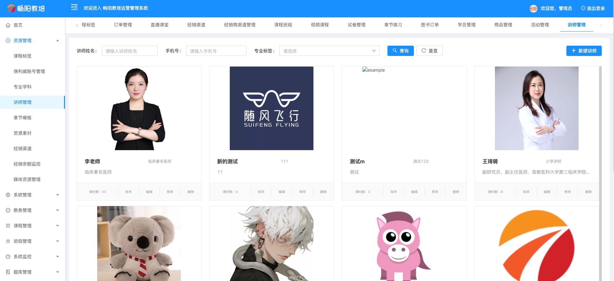
- 经销渠道-线上分润
    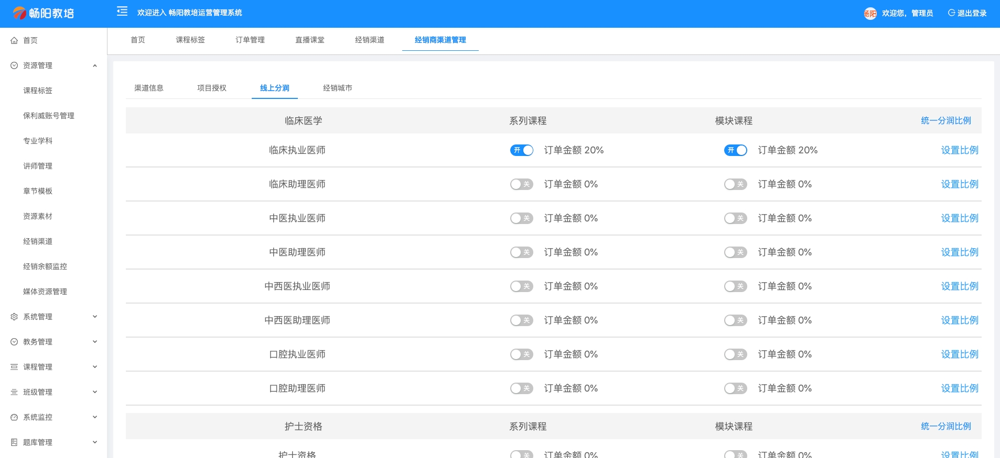
- 经销渠道-经销城市
   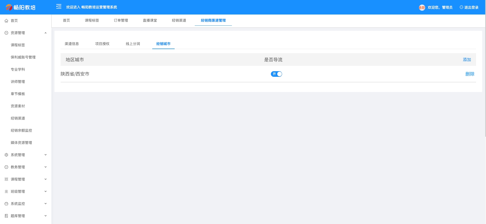
- 教务管理-直播课堂
    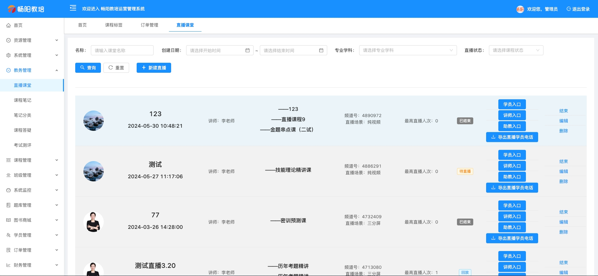
- 课程管理-视频课程
   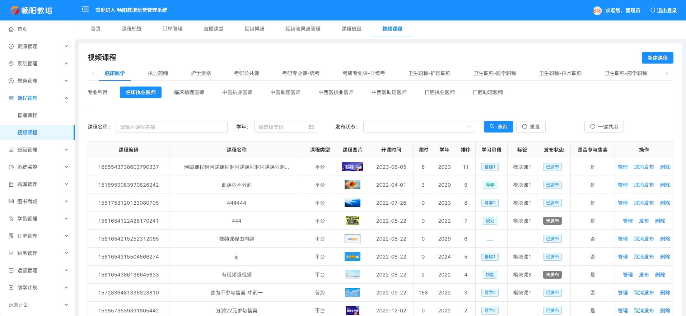
- 面授班级-配套图书
    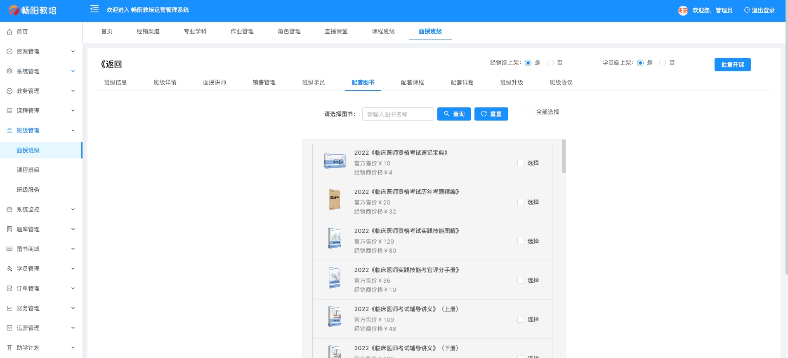
- 题库管理-章节练习
   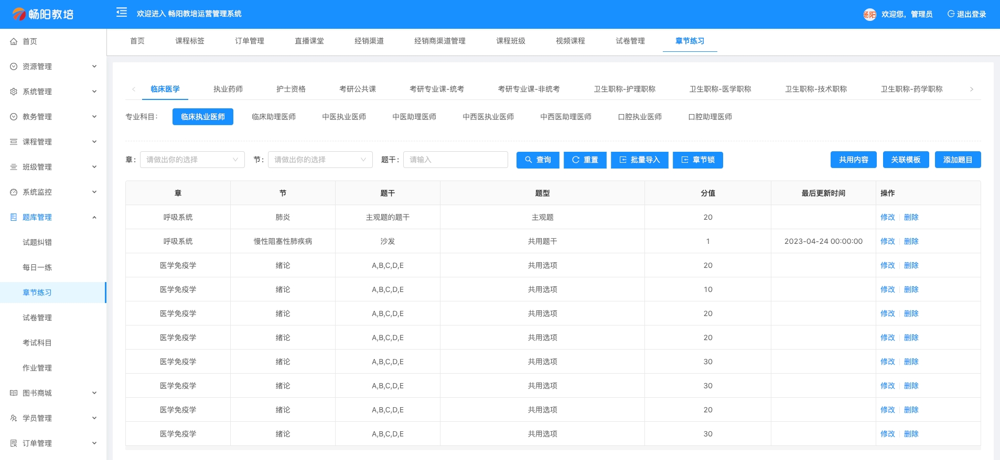

### 经销商端
- 财务管理-财务明细
    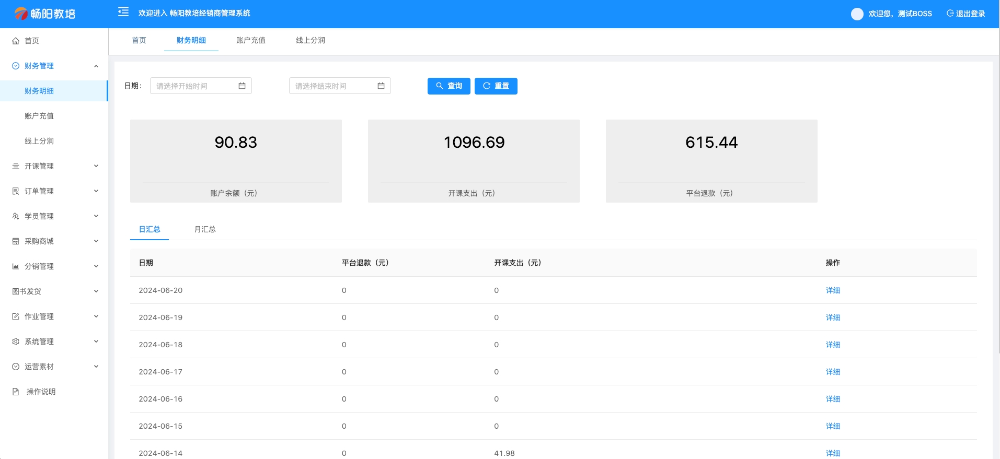
- 开课管理-课程班级
   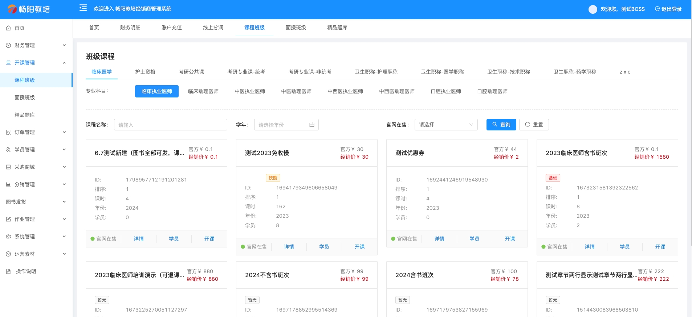
- 学员管理
    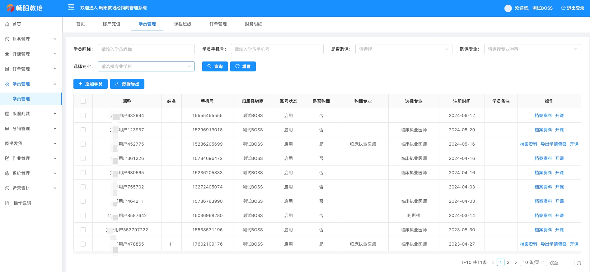
- 订单管理
   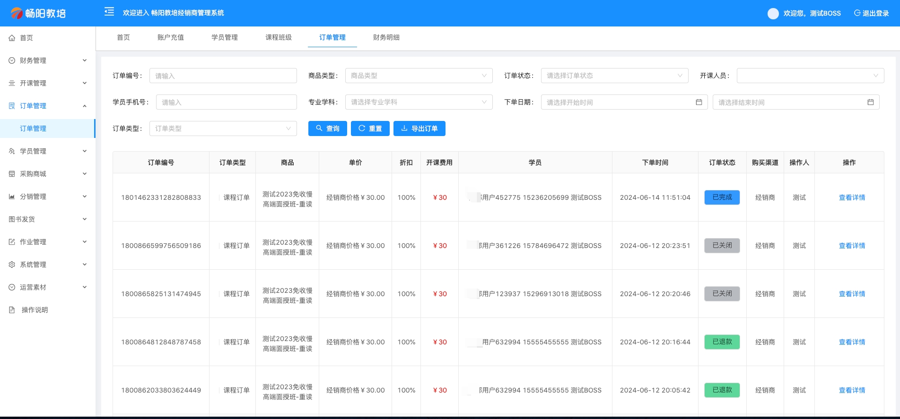
- 采购商城-采购图书
    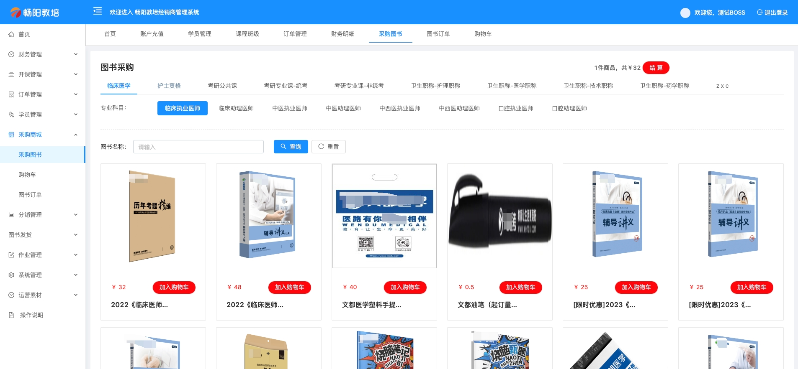
- 图书发货
   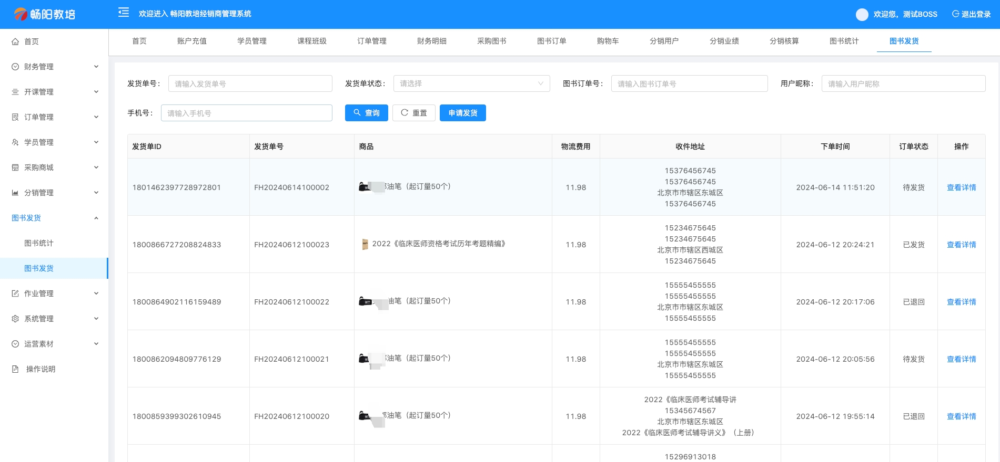
- 分销管理-分销核算
    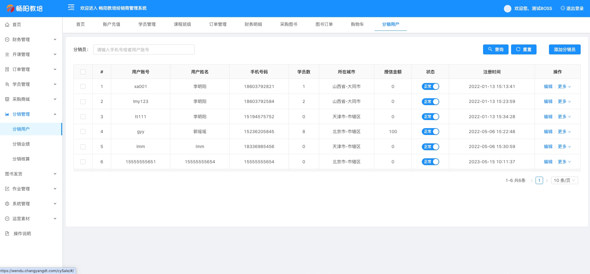
## 更新日志

### 20240626 更新畅阳教培用户端微信小程序
- 增加 流量到期提示弹窗
- 修复 题库-历年真题页面跳转异常的情况
- 畅阳教培用户端pc官网
- 增加 流量到期提示弹窗

## 许可证

[License](./LICENSE)

## 联系我们 
* 如果您想使用功能更完善的omo多分校教培系统，请联系以下企业微信！
* 如果您想基于omo多分校教培系统进行定制开发，我们提供有偿定制服务支持！
* 其他合作模式不限，欢迎来撩！


